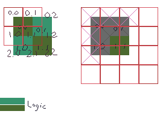

last update: 0.20b

# Notes & thanks
La generation de la map provient de deux tutoriels:  
https://bfnightly.bracketproductions.com/chapter_23.html
https://maciejglowka.com/blog/bevy-roguelike-tutorial-devlog-part-1/
Les deux logiques se battent encore l'un contre l'autre en 0.19.1.  
Cela devient un problème pour l'integration de la visibilité en 0.20  

# Processus de base
## BluePrint
Au lancement du jeu, on envoie un game_message.  
Ce game_message demande la création d'un BluePrint d'une Map.  
Ce Bluescreen est généré par des algorithmes.  
Le BluePrint est enregistrée comme Resource et retourne un map_infos contenant les points de spawn, exit, etc.  
Ce map_infos est utilisé pour placer les personnages à la création etc.  
On envoie ensuite un game_message demandant le spawn de la map.  
On fera ensuite passer le GameState en Initialise pour lancer les differents systèmes, notamment de rendu.
## Map logique
On passe sur toutes les tuiles du blueprint, et on génère une Entité pour chacune d'elle.  
On y insère la Boardposition & Tile qui contient l'info de cette tuile: Floor, Exit, Wall.  
Si la Tile Blueprint est bloquée, on y ajoute le component Occupied, qui est partagé par toutes les entités "physiques" pouvant bloquer un deplacement.  
Ces tuiles générées sont ensuite mises dans le BluePrint comme entity_tiles.  
### Notes:
- Le jeu utilise souvent les fonctions du BluePrint pour determiner ce qui est occupé ou non, plutot que le component Occupied. Cela renforce l'usage du Blueprint.  
- Les tuiles "entités" sont disponibles, mais elles ne sont pas toujours récupérées. Pour les positions on passe là encore souvent directement par le Blueprint.  
## Map rendue
A l'initialisation du jeu, on fait un spawn_map_render.  
A partir d'une query réclammant les Tiles avec BoardPosition générées dans la Map Logique, on leur donne la taille souhaitée determinée dans STANDARD_TILE_SIZE.  
Un element de complexité est que l'on passe en DualGrid, c'est à dire qu'une tuile logique est en réalité représentée par 4 corners de 4 tuiles graphiques. [voir ici](tiles.md)  
Outre le DualGrid, la map "rendue" a des elements "Wall" et des elements "floor", quand ceux-ci sont condensés en un dans la map logique et la blueprint.  
Cela cause des soucis pour la resolution de la visibilité mais est nécessaire graphiquement car les tuiles graphiques de murs sont independantes du sol pour ne pas generer trop de combinaisons graphiques. En outre la map logique n'a pas besoin d'avoir cette difference: soit on peut entrer dans la case, soit on ne peut pas.  
Aujourd'hui, pour le système de visibilité, on ajoute un component TileRender pour signaler que l'entité créé est le rendu d'une tile logique (Hors en réalité c'est 25% d'une tuile graphique qui représente la tuile logique en raison du Dual Grid), et un component TileRendered sur la tuile logique pour dire qu'elle a été représentée (hors une tile logique peut avoir deux rendus: floor & wall ou floor & exit).  
## La raison de la refacto : le besoin d'un lien entre Rendu & Logique.  
Le système de visibilité se base sur la position du personnage pour savoir s'il a le droit ou non de voir la tuile logique.  
A partir de cette information, on représente cette information au joueur en cachant la tuile "rendue".  
Hors:  
- La Tuile logique est représenté par 25% de 4 tuiles graphiques. C'est un souci moindre car cela concerne les tuiles "au bout du champ de vision" donc pas atteignable physiquement.  
- La Tuile logique est représenté par deux groupes de tuiles graphiques: le floor & le Wall. 
- Il faut pouvoir faire le lien entre la tuile logique et la tuile graphique à cacher: ce lien se fait pauvrement avec le TileRender / TileRendered mais c'est pas terrible.  
Le fonctionnement de la visibilité est aussi très très couteux: 
- On passe par toutes les tuiles logiques pour voir si elles sont ou non dans le champ de vision.  
- On récupère leur "rendu".  
- On passe le rendu en visible si dans la bonne zone, sinon en invisible.  
Cet appel se fait à chaque mouvement. Il necessite bien sûr une optimisation mais c'est assez violent.  

# Refacto : reflexions.
On génère le blueprint, qui sert de modèle de base.  
On génère la map logique, avec un HashMap qui contient en clé le Vector2Int et en valeur l'Entité. Cette entité contiendrait la BoardPosition pour les query du jeu.  
On génère la DualGrid graphique, avec un HashMap qui contient en clé un Vector2Int et en valeur l'entité. Cette entité est le Sprite d'une Tuile Graphique.  
Le lien Tuile Logique / Dual Grid se fait par une conversion:  
- La Tile Logic (0.0 "logic") est représenté par les tuiles 0.0, 0.1, 1.0 et 1.1 "Dual Grid".  
- Cela signifie qu'un "get_dualgrid_position__from_logic_position(0,0) retournerait les positions 0.0, 0.1, 1.0 et 1.1 soit (x,y), (x, y+1), (x+1,y) et (x+1, y+1).  
- Il faudrait sans doute pouvoir donner un Vec: "get_dualgrid_postion_from_logic_positions(vec[(0,0), (0,1), 1.0]) ce qui renverrait l'ensemble sans doublon.  
- A partir de ces informations, on peut les passer en visible ou hidden. Le problème sera la transition d'une tuile visible à non visible: la tuile graphique peut représenter à 75% une tuile invisible mais à 25% une tuile visible. On suppose que la priorité se ferait alors sur la visibilité. L'action de visibilité se ferait donc après l'action de rendre invisible. 
 

## Etape 1 Refacto du spawn graphic des tiles.
On avait déjà dans le spawning_map la logique Hashmap<Vecto2Int, Entity>.  
A ce stade (v1), le Hashmap est inseré dans la Blueprint `.entity_tiles`. On peut donc l'interroger.  
On peut aussi construire la dual grid en rapport.  
On decouvre qu'on a une dual grid pour le floor et une pour le wall.  
On pourrait associer les tuiles graphiques avec des componants RenderFloor et RenderWall, et les informations nw, ne, sw et se?  